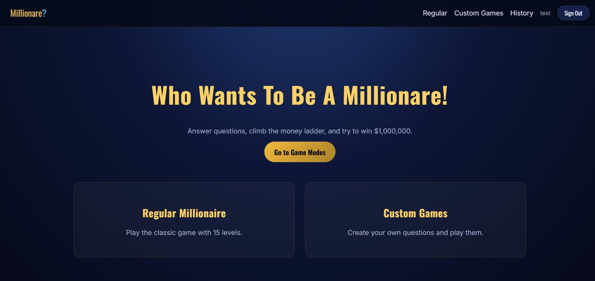
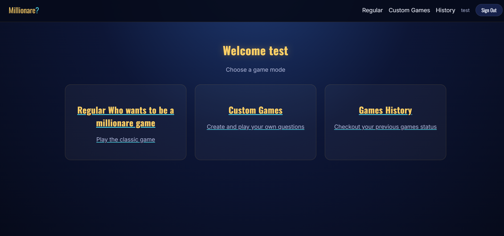
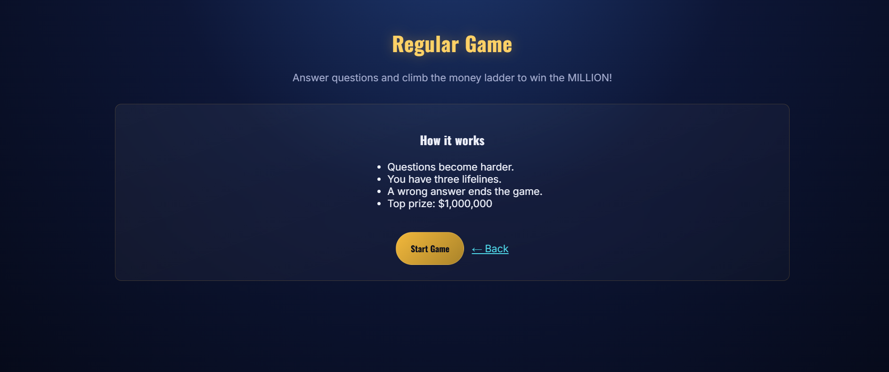
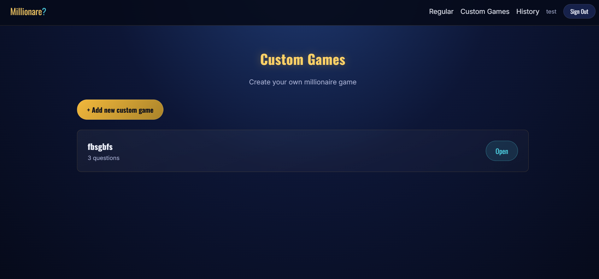

# Who Wants to Be a Millionaire Frontend

## Overview

This is the frontend for the **Who Wants to Be a Millionaire** MERN
project. It is built with React and Vite.

Users can sign up, sign in and choose between a regular Millionaire game
and custom games. Users can create their own games, add questions, edit
them, play them and view their game history. Admin users can also manage
the questions used in the regular game.

## Live Application

-   **Frontend:** Not deployed yet
-   **Backend API:** Not deployed yet
-   **Backend Repository:** https://github.com/a0m3/project-3-backend
-   **Frontend Repository:** https://github.com/a0m3/project-3-frontend

## Screenshots

### Home Page



### Dashboard



### Regular Game



### Custom Games



## Technologies Used

-   React
-   Vite
-   React Router
-   Axios
-   CSS
-   JavaScript

## Features

-   User registration and login
-   Protected routes
-   Admin protected routes
-   Regular Millionaire game
-   15-level money ladder
-   Random questions for regular games
-   Answer checking with a short delay
-   50:50 lifeline
-   Ask the Audience lifeline
-   Phone a Friend lifeline
-   Create custom games
-   Add questions to custom games
-   Edit custom games
-   Delete custom games
-   Play custom games
-   Game history
-   Profile page with game statistics
-   Admin question management
-   Responsive game interface

## Project Structure

``` text
src/
├── assets/
├── components/
│   ├── helping/
│   ├── AdminRoute.jsx
│   ├── GamePlay.jsx
│   ├── MoneyLadder.jsx
│   ├── Navbar.jsx
│   ├── ProtectedRoute.jsx
│   └── QuestionEditor.jsx
├── context/
│   └── AuthContext.jsx
├── pages/
│   ├── admin/
│   ├── customGames/
│   ├── game/
│   ├── history/
│   ├── Dashboard.jsx
│   ├── Homepage.jsx
│   ├── ProfilePage.jsx
│   ├── SigninPage.jsx
│   └── SignupPage.jsx
├── services/
│   ├── api.js
│   ├── authService.js
│   ├── customGameService.js
│   ├── historyService.js
│   └── questionService.js
├── App.jsx
├── App.css
├── index.css
└── main.jsx
```

### Folder Responsibilities

  Folder         Purpose
  -------------- -----------------------------------------------------
  `components`   Reusable components used throughout the application
  `context`      Stores authentication state and user information
  `pages`        Contains the different pages of the application
  `services`     Handles API requests to the backend
  `assets`       Stores images and other frontend assets
  `App.jsx`      Contains the main application routes
  `main.jsx`     Starts the React application

## Getting Started

### Prerequisites

Install:

-   Node.js

The backend API also needs to be running.

## Installation

### 1. Clone the repository

``` bash
git clone https://github.com/a0m3/project-3-frontend.git
cd project-3-frontend
```

### 2. Install dependencies

``` bash
npm install
```

### 3. Create the environment file

Create a `.env` file in the root directory:

``` env
VITE_BACK_END_SERVER_URL=http://localhost:3000
```

### 4. Start the development server

``` bash
npm run dev
```

Go to:

``` text
http://localhost:5173
```

## Application Routes

  Route                         Page                  Access
  ----------------------------- --------------------- ---------------
  `/`                           Home page             Public
  `/sign-up`                    Sign up               Public
  `/sign-in`                    Sign in               Public
  `/dashboard`                  Dashboard             Authenticated
  `/play/regular`               Regular game          Authenticated
  `/custom-games`               Custom games list     Authenticated
  `/custom-games/new`           Create custom game    Authenticated
  `/custom-games/:id`           Custom game details   Authenticated
  `/custom-games/:id/edit`      Edit custom game      Authenticated
  `/custom-games/:id/play`      Play custom game      Authenticated
  `/history`                    Game history          Authenticated
  `/profile`                    User profile          Authenticated
  `/admin/questions`            Admin question list   Admin
  `/admin/questions/new`        Add question          Admin
  `/admin/questions/:id/edit`   Edit question         Admin

## How the Game Works

### Regular Game

1.  Sign in to your account.
2.  Go to the dashboard.
3.  Choose **Regular Game**.
4.  The backend selects questions for the game from the question
    database.
5.  Answer each question to move up the money ladder.
6.  Use the available lifelines when needed.
7.  A wrong answer ends the game.
8.  You can also walk away from the game.
9.  The result is saved to your game history.

### Custom Games

1.  Go to **Custom Games**.
2.  Select **Add New Custom Game**.
3.  Give your game a name.
4.  Add questions and four answer options for each question.
5.  Select the correct answer and set the level.
6.  Save the game.
7.  Open the custom game and select **Start Game**.
8.  You can also edit or delete your own custom games.

### Lifelines

The game includes three lifelines:

-   **50:50** removes two wrong answers.
-   **Ask the Audience** gives percentage results for the four answers.
-   **Phone a Friend** gives a suggested answer.

Each lifeline can only be used once during a game.

## User Stories

-   As a user, I want to create an account so I can play the game.
-   As a user, I want to sign in so my game history can be saved.
-   As a user, I want to play a regular Millionaire game.
-   As a user, I want to use lifelines to help answer difficult
    questions.
-   As a user, I want to create my own custom game.
-   As a user, I want to add questions and answers to my custom game.
-   As a user, I want to edit and delete my own custom games.
-   As a user, I want to see my previous game results.
-   As an admin, I want to add, edit and delete regular game questions.

## Future Enhancements

-   Add multiplayer support
-   Add more question categories
-   Add more lifelines
-   Add sound effects and game animations
-   Deploy the frontend and backend
-   Add more detailed game statistics

## Team Members

  -----------------------------------------------------------------------------------
  GitHub                                          Responsibilities
  ----------------------------------------------- -----------------------------------
  [a0m3](https://github.com/a0m3)                 Frontend and backend development

  [mohasa7an22](https://github.com/mohasa7an22)   Frontend and backend development
  -----------------------------------------------------------------------------------

## Credits

Built as a MERN Stack project.
